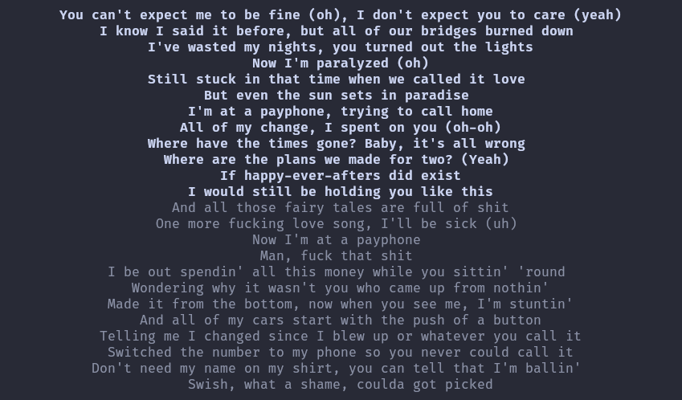

# sptlrx-ex

`sptlrx-ex` relays synced lyrics from Spotify Web Player to your local terminal.
This is an independent app inspired by [`sptlrx`](https://github.com/raitonoberu/sptlrx)'s terminal UI.



## What this project does

- A Tampermonkey userscript watches `https://open.spotify.com` for lyric updates.
- The userscript forwards normalized lyric state to a local Rust relay.
- The relay renders to terminal in either:
  - `full` mode: centered multi-line display
  - `pipe` mode: one current line per event

## Requirements

- Rust toolchain (stable)
- Tampermonkey
- Browser that can run Spotify Web Player

## Quick start

1. Start the relay.

```bash
cargo run --release
```

Or with Nix from this repository:

```bash
nix run .
```

You can also install it into your profile and run it as a command:

```bash
nix profile add github:yadokani389/sptlrx-ex
```

2. Open Tampermonkey dashboard.
3. Create a new script and paste `tampermonkey/sptlrx-ex.user.js`.
4. Save and enable the script.
5. Open `https://open.spotify.com`, then use Tampermonkey menu commands:
   - `sptlrx-ex: Set relay URL`
   - `sptlrx-ex: Reset relay URL`
   - `sptlrx-ex: Show relay URL`
6. Open Spotify's lyrics view for the current track, then play a track with synced lyrics.

If the lyrics panel is closed, the relay reports `lyrics_panel_closed` and cannot detect the current lyric line.

The userscript only accepts localhost relay URLs (`127.0.0.1` or `localhost`) for safety.

## Multiple instances

You can start multiple relay processes with the same command. In `auto` role:

- First process binds `host:port` and runs bridge mode.
- Next processes detect the existing bridge and switch to client mode automatically.

Example:

```bash
cargo run -- --role auto --mode full --port 17373
cargo run -- --role auto --mode pipe --port 17373
```

The second command does not bind again; it polls `/state` from the first process.

## Relay options

Use CLI flags:

```bash
cargo run --release -- --mode pipe --length 60 --overflow ellipsis
```

### Supported flags

- `--role <auto|bridge|client>`
- `--mode <full|pipe>`
- `--debug` / `--no-debug`
- `--length <n>`
- `--overflow <word|none|ellipsis>`
- `--host <host>`
- `--port <port>`
- `--upstream <base-url>`
- `--poll-ms <n>`
- `--help`

### Role behavior

- `auto` (default): tries to bind `host:port`; if the port is already used and `GET /health` looks like `sptlrx-ex`, it switches to client mode automatically.
- `bridge`: always starts HTTP ingest server and renderer; exits on bind errors.
- `client`: does not bind; polls `<upstream>/state` and renders locally (Rust client mode).

## Endpoints

- `GET /health` -> relay health and active mode
- `GET /state` -> last accepted lyric payload
- `POST /lyrics` -> lyrics ingest endpoint

## Development

Run checks:

```bash
cargo fmt
cargo check
cargo test
```

## Security notes

- Relay binds to `127.0.0.1` by default.
- Keep the relay host local-only unless you add your own network-level protections.

## Known limitations

- Spotify DOM selectors may break after Spotify UI updates.
- Lyric active-line detection still relies on heuristic fallback.
